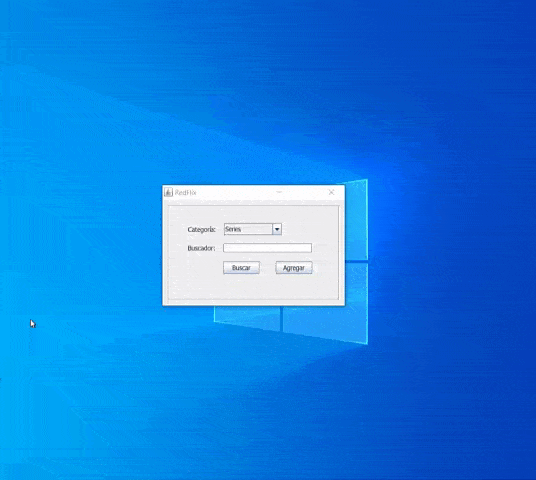

# Ciclo II

Programación orientada a objetos con Java. Cada ciclo tiene 5 retos para validar lo aprendido.

- Programación orientada a objetos con Java
- Bases de datos con MySQL
- Introducción a Spring
- *Proyecto final:* Aplicación Redflix Java+MySQL
